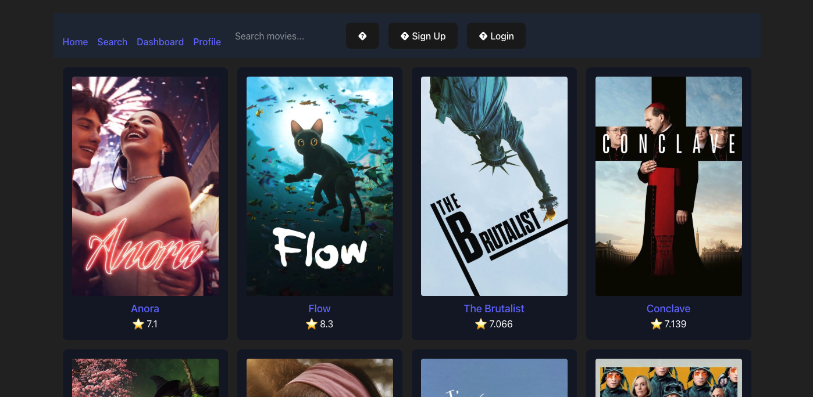

# Mobie Theater

## Mob + Movie Theater

> Now visible at [this link!](https://mobietheater.vercel.app/)

## (New) Two New Features

These new two features are:

1. Individual profile pages
2. Now comments have dates and profile pictures.

_These new features are still in development._

---

Continuous development project made to showcase advanced web development techniques using React and TMBD API.



Current image as of March 4th, 2025.

### Installation

```bash
npm i
```

Create an `.env` variable at the root of the project and add the ones mentioned in the **Environment Variables** section below.

### How to Run

```bash
npm run dev
```

### Environment Variables

```bash
VITE_MDB_API_KEY = [TMBD API Token]
VITE_FIREBASE_API_KEY = [Firebase API Key]
VITE_FIREBASE_AUTH_DOMAIN = [Firebase Auth Domain]
VITE_FIREBASE_PROJECT_ID = [Firebase Project ID]
VITE_FIREBASE_STORAGE_BUCKET = [Firebase Storage Bucket]
VITE_FIREBASE_MESSAGING_SENDER_ID = [Firebase Messaging Sender ID]
VITE_FIREBASE_APPID = [Firebase App Id]
VITE_FIREBASE_MEASUREMENTS_ID = [Firebase Measurements ID]
```
